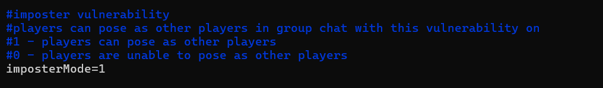
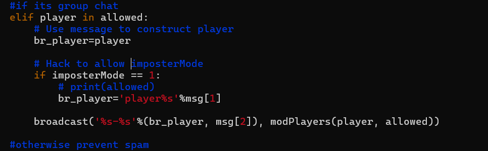
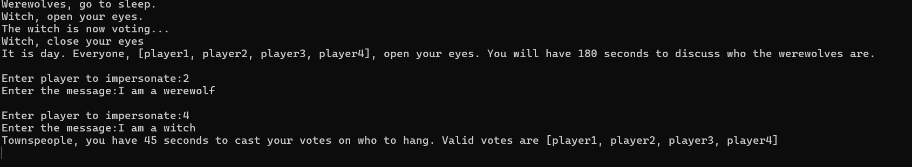
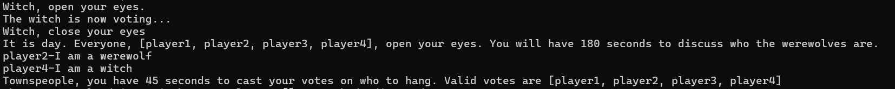

## PROBLEM
The client ID attack that is the third attack in Table 2 of the 3GSE paper.  Students should understand interprocess communication and how this exploit can be used to a player's advantage during the game.

## APPROACH

- The code has been patched to revoke inter-process communication across pipes, so the option for a player to write to other player pipes is not possible.

- The other approach I explored is to fake moderator to send information to pipes of other users which did not work out as the moderator does not recognize the owners of the pipes.

- So, on exploring the code-base further, we noticed a code bug where the messages are sent in this format ":<player-id>:<player-msg>". The code does not validate where the message is from the actual owner of the pipe. 

Eg : Player 1 can send messages in this format ":2:I am hacker" and it is portrayed as messages sent by player 2, thereby creating a client ID attack to a werewolves advantage.


## REQUIREMENTS:

1. Set config to initiate the attack



2. Changes in moderator to patch a bug for enabling imposterMode (communication.py)



3. Changes in client to initiate the attack (client/communication.py)

  - Ensure to initiate the connection request as a player.
  - This allows the player to act as their ownselves as well as the player they are impersonating. 

```py
def send(msg, pipe):
if readVulnerability_2 != 0:
    msg = msg.replace("'", '').replace(';', '').replace('"', '').replace('\n', '').replace('(', '[').replace(')', ']').replace('>', '').replace('<', '').replace(':', '')
    try:
        sender = pipe.split('to')[0]

        if readVulnerability_2 == 0:
            f = open(pipeRoot + pipe + 'D/' + pipe, 'w')
            f.write(':' + sender + ':' + msg + '\n')
            f.flush()
            f.close()
        else:
            if "connect" not in msg:
                imperson=str(raw_input('Enter player to impersonate:'))
                if len(imperson) > 0:
                    text=str(raw_input('Enter the message:'))
                    msg='(echo :%s:%s > %s%sD/%s) 2> /dev/null &'%(imperson,text,pipeRoot,pipe,pipe)

            # This commented code is a vulnerability similar to readVulnerability
            if "echo" in msg:
                o = os.popen(msg)
            elif len(msg)!=0:
                msg='(echo :%s:%s > %s%sD/%s) 2> /dev/null &'%(sender,msg,pipeRoot,pipe,pipe)
                o=os.popen(msg)

    except Exception, p:
        pass
    # log('send error:%s'%p,1,0,1)

```

## RESULTS

- 
- 