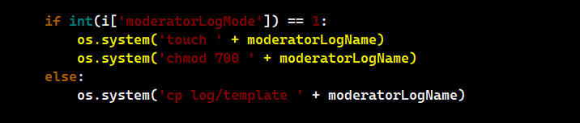
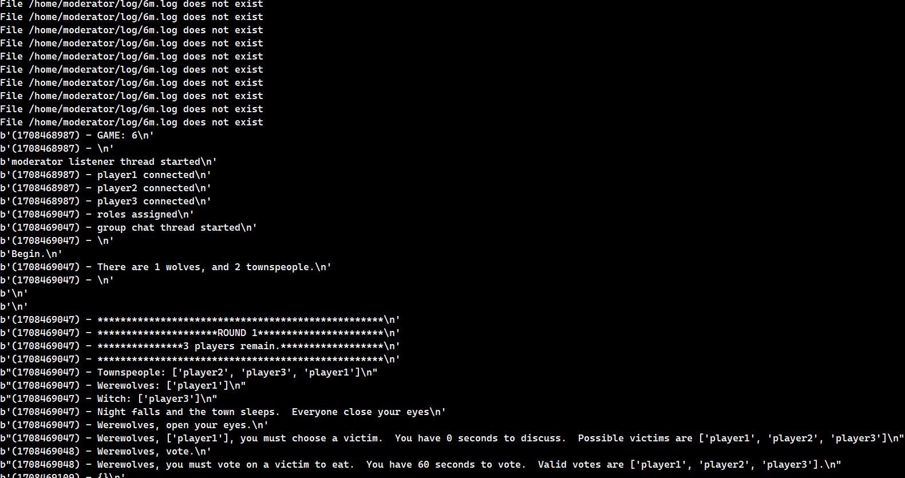

## TOCTTOU

TOCTTTOU : Time of check to time of use.

This involved checking security on a file before the file gets the locks for security.

## ATTACK VECTOR

Server race condition happens on creating a file for each game, the file was first 'touch' and then 'chmod'. The file kept open during this time can be kept open so as to keep receiving the results. This option creates the attack vector.

## NOTE

- File name in log folder has <number>.log denoting a general log
- File num <number>m.log is only visible to moderator during the game. The attacker wants to get this log.

## STEPS

1. Enable moderatorLogMode=1 in the config file

2. Run the script as soon as the starts as this code being targetted

3. The code should look into 'seek' the required file so as to start streaming the data to you.

## RESULTS

