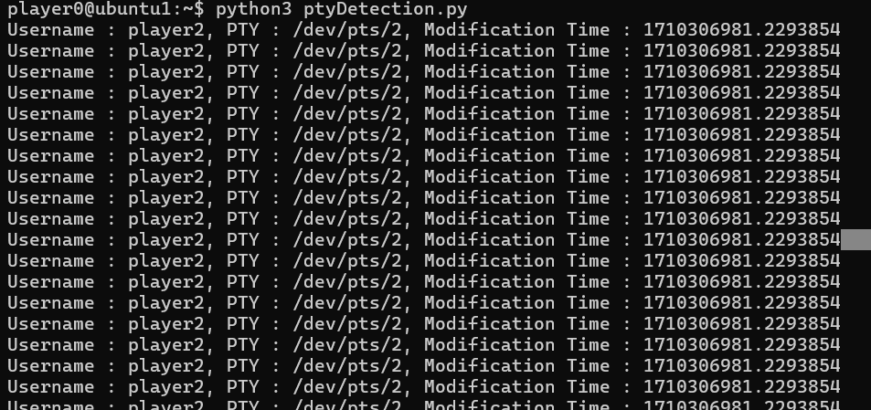
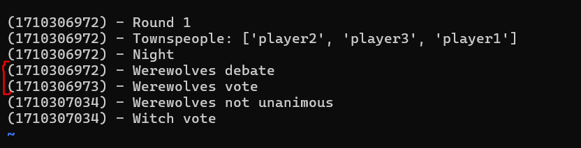

## PTY Detection Attack

The approach is detecting who is typing using pseudo-terminal (pty) files involves monitoring the input/output streams of the terminal and determining the source of the input.

## Attack vector

Users logging in via SSH sessions generate a pseudo terminal device for I/O actions. The device is listed in a publicly accessible path which can be monitored to know when the session is active.

## SOURCE

Refer to [file](ptyDetectionVulnerability.py).

## STEPS:

1. Run the script as soon as the game starts.

2. The script currently just detects werewolves 

3. The moderator and pty for player running the attack will always be active so ignore those and focus only on the other players.

## RESULTS

- Getting the wolves during the wolf voting period

  - 

- The time stamp deciding this case

  - 
