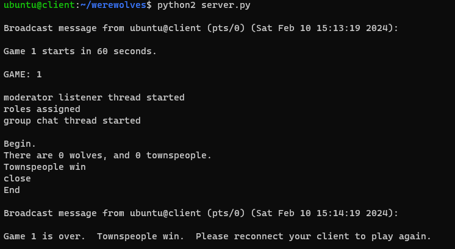

### HOMEWORK 1
---------------
#### STEP 1 : SETUP Multipass
[Docs](docs/multipass.md)

#### STEP 2 : SETUP Tailscale
[Docs](docs/tailscale.md)
#### STEP 3 : SETUP for Werewolves

- Download werewolves  : ``` wget https://jedcrandall.github.io/courses/cse536spring2024/werewolves-spring24.tgz ```


- Extract the folder ``` tar -xzvf werewolves-spring24.tgz ```


- Change working directory to extracted folder path

- Run ```./install.sh```


- Install python2 as the project requires python  2: ```sudo apt install python2```


- Run server.py


