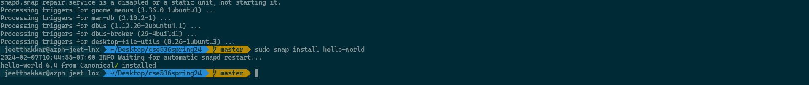
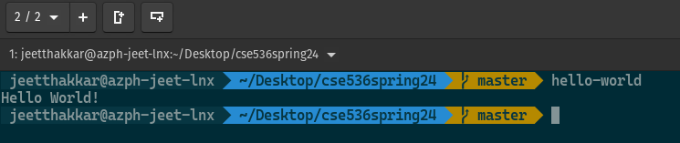
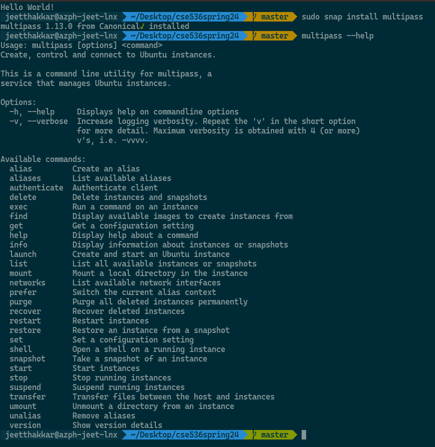
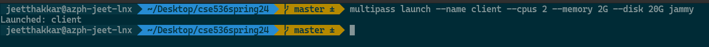
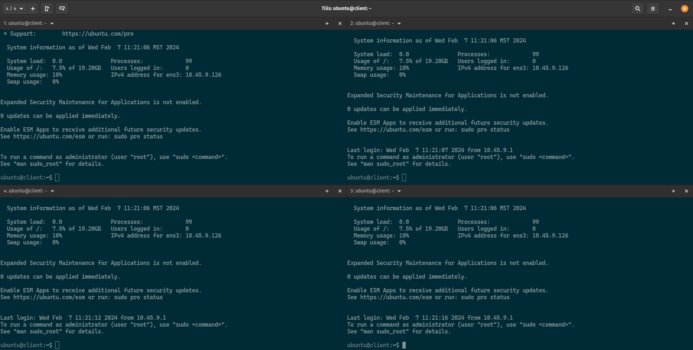
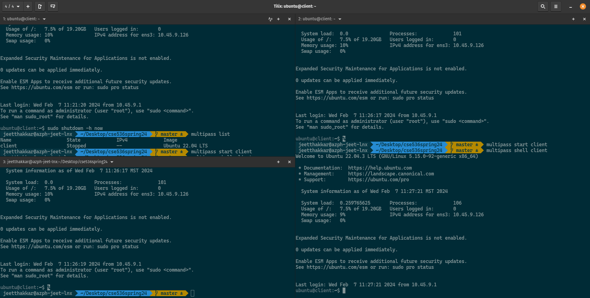
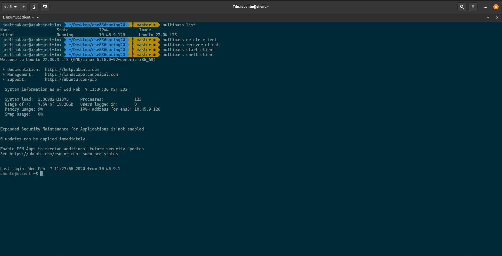
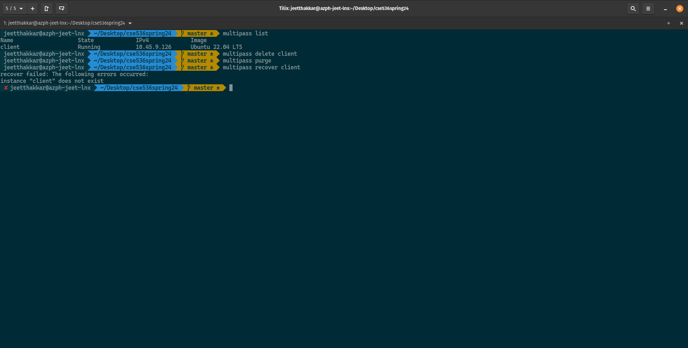

# Installing Multipass to create on-demand Ubuntu VMs

This doc has the instructions for creating on-demand ubuntu instances on any machine which has the capability of running hypervisors. The application uses Oracle VirtualBox/HyperV on Windows to create these instances, libvirt on Linux Machines and something else on macOS to create these VMs. 

The documentation for multipass can be found at: [https://multipass.run/docs](https://multipass.run/docs).  

## Installation on different platforms

### On Linux

For Linux it is best to use a distribution which is able to use `snap` package . Ubuntu has support for snaps out of the box; any other debian based system (like pop-os) is able to install them locally. Snaps are canonical specific application installers, just like `.deb` files for debian based distros or `.rpm` files for Fedora-like distros. Feel free to skip steps 1-? on ubuntu. 

We are following the instructions from here: [https://multipass.run/docs/get-started-with-multipass-linux#heading--install-multipass](https://multipass.run/docs/get-started-with-multipass-linux#heading--install-multipass)

1. Download and Install Snap. asmentioned before you only need to do this non-Ubuntu distros; If you are using ubuntu later than v18.04, you should be fine. In this example I am using Pop-OS, so I have to install it. the following commands are for debian based distributions only; Fedora based distros (RHEL, CentOS etc) consult the docs: The full instructions are given here: [https://multipass.run/docs/get-started-with-multipass-linux#heading--install-multipass](https://multipass.run/docs/get-started-with-multipass-linux#heading--install-multipass)
```bash
sudo apt update && \
sudo apt install snapd
```

2. You can check if the snap process installed successfully by running the following command in the terminal - `sudo snap install hello-world` and then run the `hello-world` command in the terminal to get an output.



3. Once snap is installed, Run the following command to install `multipass` (for other OSes, go here: [https://multipass.run/docs/how-to-guides](https://multipass.run/docs/how-to-guides))
```bash
sudo snap install multipass
```

4. Run the `multipass --help` command in the terminal to see all the options associated with the application and VMs.



## Using Multipass to create/operate the VMs

The following steps assume that the multipass application has been successfully installed in your machine.

1. Once multipass is installed, we can run the following command to create an on-demand ubuntu VM. The following command creates a Ubuntu 22.04 VM (replace `jammy` with `focal` to create a ) with the name `client` with 2 vCPUs, 2GB RAM and 20GB disk space. Modify the paramaeters as you fit and according to your machine's specifications. This process first fetches the ubuntu image (which is a minial preconfigured base image for the ubuntu VM (kind of like a container image)), and then launches it as a VM on your system.
```bash
multipass launch --name client --cpus 2 --memory 2G  --disk 20G jammy
```

> Note: If you run just `multipass launch` it iwll create an LTS instance of ubuntu with your `$HOME` directory of the current user mounted inside the VM with the name `primary`. It does this because this is a tool for people to mess with ubuntu without dual booting their OS. This type of instance makes it possible to do so with all your files inside the VM already. 

2. Once it launches the VM, it runs in the background waiting for you to connect to it. To see details about the VM run, `multipass list` to list all of the VMs which have been created by multipass. 

3. To connect to a multipass instance, run the `multipass shell <instance-name>` command; In our case, it will be `multipass shell client` to open a shell into the VM. You can run this command in multiple tabs of a terminal, to get multiple concurrent shells into your system. see screenshot below:



4. to safely stop a instance, you can either go into the shell for that VM and run `sudo shutdown -h now` or you can run the `multipass stop <instance-name>` command. HOwever, to start you have to run `multipass start client`. Starting/Stopping a instance will terminate all local/remote shell sessions to the instance. 



5. To delete a VM, run the `multipass delete <instance-name>` command to delete the instance. IF you delete a multipass VM it does not get deleted permanently - just the VM file gets deleted, but the virtual disk still exists on the machine. it can be recovered using the `multipass recover <client-name>` command. If you are confident about the deletion then you can run the `multipass purge` command which permanantly deletes the VM.

     

this is the basic commands for operation of multipass.