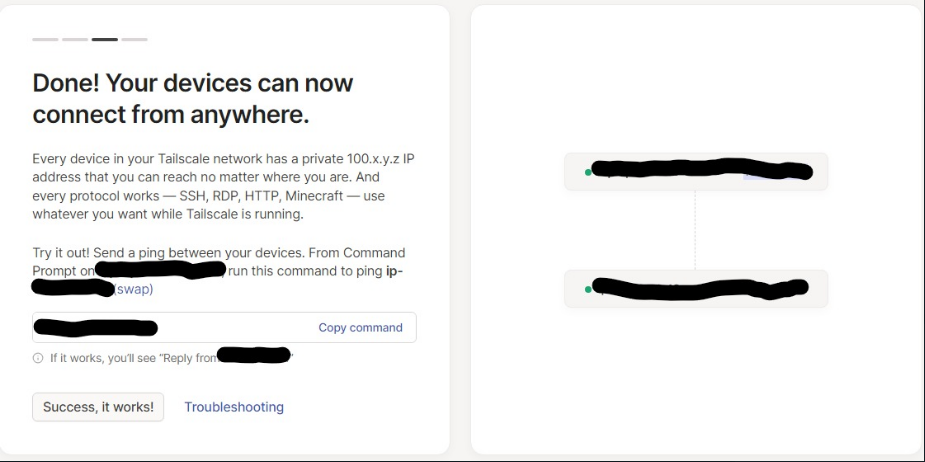

### Setting up tailscale in Linux 

- curl -fsSL https://tailscale.com/install.sh | sh
- [Source](https://tailscale.com/kb/1031/install-linux)

### Setting up tailscale in Windows

- [Source](https://tailscale.com/kb/1022/install-windows)

- ```sudo tailscale up```

### Adding devices

- As you install tailscale in your inctances and sign in to your created account, the instances get added to tailscale.

- 

### Enable Tailscale SSH

- ```tailscale set --ssh```

### Sharing device

- Share invite link to allow others to add ypur device

- 
